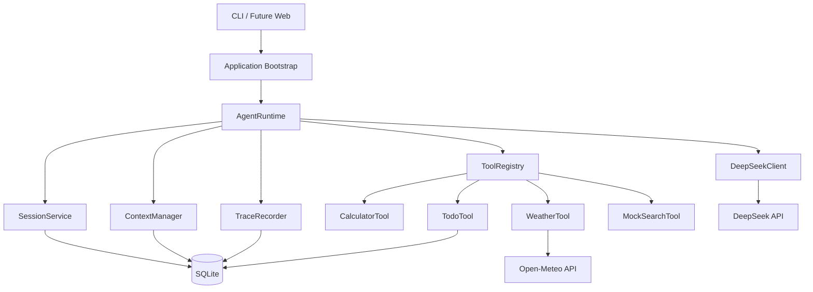
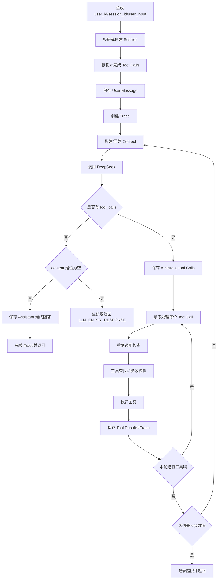

# 基于 CoreCoder 重构最小 Agent Runtime：完整开发与测试方案

> 目标：在保留 CoreCoder 仓库外壳、Python 环境和部分工程经验的前提下，**从零重新实现核心 Agent Runtime**，最终交付一个可运行的最小 Agent，支持：
>
> - 真实 DeepSeek LLM API
> - OpenAI-compatible Tool Calls / Function Calling
> - 直接回答与工具调用自主决策
> - 多轮 Agent Loop
> - `user_id + session_id` 会话隔离
> - SQLite 持久化与历史恢复
> - Session 列表、摘要展示和切换
> - 基础 Context 压缩
> - 最大轮次、重复调用和异常保护
> - 工具调用 Trace / 执行日志
> - 单元测试、集成测试和真实 API 冒烟测试
>
> 本文档按阶段执行。每个阶段都有明确的目标、文件改动、测试和验收标准。严格按顺序开发，可以避免一次性重构范围过大。

---

## 1. 最终结果是什么

最终程序是一个 CLI Agent。用户可以启动程序、创建或切换 Session，并与 Agent 连续对话。

示例：

```text
$ mini-agent --user-id user_a

Mini Agent Runtime
Current session: session_20260728_abc123
Model: deepseek-v4-pro

user> 帮我计算 123 * 456
> tool_call calculator {"expression":"123 * 456"}
< tool_result success
assistant> 计算结果是 56088。

user> 查一下北京明天的天气，如果可能下雨就帮我记一个带伞的待办
> tool_call weather {"city":"北京","date":"tomorrow"}
< tool_result success
> tool_call todo {"action":"add","content":"明天带伞"}
< tool_result success
assistant> 北京明天有降雨可能，已在当前会话中添加“明天带伞”的待办。
```

用户可以管理会话：

```text
user> /sessions
ID                         摘要/标题                         更新时间
session_weather            查询北京天气并维护出行待办       2026-07-28 20:10
session_weekly_report      讨论周报内容和工作待办           2026-07-28 19:30

user> /switch session_weather
已切换到 session_weather

user> 那上海呢？
> tool_call weather {"city":"上海","date":"tomorrow"}
assistant> ……
```

两个 Session 的消息、摘要、工具上下文和 Todo 完全隔离。

---

## 2. 为什么采用“重构式开发”，而不是直接修改旧 `Agent.chat()`

CoreCoder 当前实现适合学习，但与笔试目标存在明显差异。

### 2.1 当前 CoreCoder 的核心结构

现有代码中：

- `corecoder/agent.py`
  - 保存内存消息 `self.messages`
  - 构建上下文
  - 调用 LLM
  - 判断 Tool Calls
  - 查找、校验和执行工具
  - 并行执行工具
  - 控制循环次数
- `corecoder/llm.py`
  - 默认使用流式输出
  - 拼接文本和 Tool Call 参数
  - 封装 OpenAI-compatible API
- `corecoder/context.py`
  - 直接修改内存中的 `messages`
  - 用假的 user/assistant 消息表示摘要
- `corecoder/session.py`
  - 手动将整个消息列表保存为 JSON 文件
  - Session 没有 `user_id` 隔离
- `corecoder/tools/__init__.py`
  - 通过全局 `ALL_TOOLS` 静态注册编码工具

### 2.2 不能只在旧循环上打补丁

若直接在旧 `Agent.chat()` 中加入 SQLite、Session、Trace 和压缩，最终会变成一个承担过多职责的大类：

```text
Agent
├── 管理消息
├── 操作数据库
├── 调用 LLM
├── 解析 Tool Calls
├── 调用工具
├── 压缩 Context
├── 管理 Session
└── 写 Trace
```

这既难测试，也难向面试官解释 Runtime 的模块边界。

### 2.3 本方案的原则

在原仓库中创建一个全新的 Python 包 `mini_agent/`：

- 不从旧 `corecoder.agent.Agent` 继承；
- 不导入旧 `ALL_TOOLS`；
- 不复制旧 Agent Loop 后只改名称；
- 新 Runtime、Session、Context、Trace 和工具注册机制全部独立实现；
- 旧 `corecoder/` 在开发过程中仅作为参考和回归基线；
- 新系统全部测试通过后，再删除旧编码 Agent 代码并修改项目名称。

这样既保留 CoreCoder 仓库的环境和学习价值，也能明确证明核心 Runtime 是重新设计和实现的。

---

## 3. 已敲定的技术决策

| 项目 | 决策 |
|---|---|
| 开发方式 | 在 CoreCoder 仓库中新建独立包，逐步替换旧实现 |
| LLM | DeepSeek API |
| 模型 | `deepseek-v4-pro` |
| API 协议 | OpenAI-compatible Chat Completions + Tool Calls |
| 第一版输出 | 非流式 `stream=False` |
| 思考模式 | 显式关闭 |
| 工具 | `calculator`、`weather`、`todo`、`search` |
| Weather | Open-Meteo 真实接口 |
| Search | Mock 模拟数据 |
| Todo | Session 级别，SQLite 持久化 |
| Session | `user_id + session_id` 隔离 |
| 数据库 | Python 标准库 `sqlite3` |
| 工具执行 | 按模型返回顺序执行，不做并行 |
| 最大 Agent 步数 | 默认 8 |
| 重复保护 | 同一工具和相同参数连续最多调用 2 次 |
| Context 软限制 | 32,000 tokens |
| 70% 阈值 | 生成/更新摘要，保留近期完整消息 |
| 90% 阈值 | 摘要 + 更小的近期窗口 |
| 原始消息 | 永久保存在 SQLite，压缩不修改原始记录 |
| Trace | 记录可观察决策，不保存完整 Chain of Thought |
| 第一版界面 | CLI |
| Web | Runtime 稳定后作为可选最终阶段 |

DeepSeek 官方文档说明其 API 可使用 OpenAI SDK，支持非流式调用、`deepseek-v4-pro`、Tool Calls，并可通过 `extra_body={"thinking":{"type":"disabled"}}` 关闭默认思考模式：

- https://api-docs.deepseek.com/
- https://api-docs.deepseek.com/zh-cn/guides/tool_calls/
- https://api-docs.deepseek.com/zh-cn/guides/thinking_mode/

Open-Meteo 文档：

- 地理编码：https://open-meteo.com/en/docs/geocoding-api
- 天气预报：https://open-meteo.com/en/docs

---

## 4. 最终架构



### 4.1 各模块职责

#### `AgentRuntime`

只负责流程调度：

- 接收 `user_id`、`session_id`、`user_input`；
- 控制 Agent Loop；
- 调用 Context、LLM、Tool Registry 和 Trace；
- 判断最终回答、工具调用、异常和终止条件；
- 不直接写 SQL；
- 不直接实现工具业务。

#### `SessionService`

- 创建 Session；
- 校验 Session 所有者；
- 查询 Session 列表；
- 切换与恢复；
- 提供摘要/标题预览。

#### `ContextManager`

- 从数据库加载摘要和消息；
- 估算 Token；
- 保证 Tool Call 消息组完整；
- 决定是否压缩；
- 调用摘要器；
- 构建本轮发送给 LLM 的消息。

#### `DeepSeekClient`

- 使用 OpenAI SDK 请求 DeepSeek；
- 关闭思考模式和流式输出；
- 将 SDK 响应转换成内部 `LLMResponse`；
- 处理超时、限流、连接失败和服务端错误；
- 不执行工具。

#### `ToolRegistry`

- 注册工具；
- 检查工具重名；
- 输出工具 Schema；
- 查找工具；
- 校验模型参数；
- 调用工具并统一返回 `ToolResult`。

#### `TraceRecorder`

- 创建 Trace；
- 记录每次 LLM 决策；
- 记录工具名称、参数、结果、耗时和错误；
- 标记任务成功、失败、超限或中断。

#### Repository 层

- 封装 SQLite SQL；
- Runtime 不允许直接编写 SQL；
- SQLite 是唯一真实数据源；
- 内存对象只是单次请求中的临时对象。

---

## 5. 目标目录结构

开发初期保留旧 `corecoder/`，新建如下目录：

```text
CoreCoder-main/
├── corecoder/                     # 旧实现，开发期间仅作参考
├── mini_agent/                    # 新实现
│   ├── __init__.py
│   ├── __main__.py
│   ├── bootstrap.py               # 组装依赖
│   ├── config.py
│   ├── cli.py
│   ├── prompts.py
│   │
│   ├── domain/
│   │   ├── __init__.py
│   │   ├── models.py              # ToolCall、Message、AgentResult 等
│   │   └── errors.py              # 自定义异常
│   │
│   ├── runtime/
│   │   ├── __init__.py
│   │   ├── agent_runtime.py
│   │   └── repetition_guard.py
│   │
│   ├── llm/
│   │   ├── __init__.py
│   │   ├── base.py                # LLMClient Protocol/ABC
│   │   └── deepseek_client.py
│   │
│   ├── tools/
│   │   ├── __init__.py
│   │   ├── base.py
│   │   ├── registry.py
│   │   ├── calculator.py
│   │   ├── weather.py
│   │   ├── todo.py
│   │   └── search.py
│   │
│   ├── storage/
│   │   ├── __init__.py
│   │   ├── database.py
│   │   ├── schema.sql
│   │   ├── session_repository.py
│   │   ├── message_repository.py
│   │   ├── summary_repository.py
│   │   ├── todo_repository.py
│   │   └── trace_repository.py
│   │
│   ├── session/
│   │   ├── __init__.py
│   │   └── service.py
│   │
│   ├── context/
│   │   ├── __init__.py
│   │   ├── token_estimator.py
│   │   ├── message_groups.py
│   │   ├── compressor.py
│   │   └── manager.py
│   │
│   └── trace/
│       ├── __init__.py
│       └── recorder.py
│
├── tests/
│   ├── unit/
│   ├── integration/
│   ├── live/
│   ├── fakes/
│   │   └── scripted_llm.py
│   └── conftest.py
│
├── data/
│   └── .gitkeep
├── docs/
│   ├── architecture.md
│   ├── context-and-memory.md
│   ├── test-cases.md
│   └── ai-development-log.md
├── .env.example
├── pyproject.toml
└── README.md
```

最终新系统稳定后：

1. 删除旧 `corecoder/agent.py`、旧工具和 JSON Session；
2. 可删除整个旧 `corecoder/`；
3. 将 `mini_agent` 保留为最终包；
4. 在 `pyproject.toml` 中将项目名改为 `minimal-agent-runtime`；
5. CLI 命令改为 `mini-agent`。

---

## 6. 核心数据模型

推荐使用 `dataclasses` 表示 Runtime 内部对象，使用 Pydantic v2 表示工具参数。

### 6.1 Tool Call 和 LLM 响应

```python
from dataclasses import dataclass, field
from typing import Any

@dataclass(frozen=True)
class ToolCall:
    id: str
    name: str
    arguments: dict[str, Any] | None
    raw_arguments: str
    parse_error: str | None = None

@dataclass
class LLMResponse:
    content: str
    tool_calls: list[ToolCall] = field(default_factory=list)
    prompt_tokens: int = 0
    completion_tokens: int = 0
    finish_reason: str | None = None
    raw_message: dict[str, Any] | None = None
```

`raw_arguments` 必须保留。不要像旧代码一样，在 JSON 解析失败时静默变成 `{}`。解析失败时保留 Tool Call 的 `id`、`name` 和原始参数，同时设置 `parse_error`，随后由 ToolRegistry 返回结构化的 `INVALID_TOOL_ARGUMENTS` 结果。这样不会掩盖错误，也不会因为一次格式错误直接破坏整个 Agent Loop。

### 6.2 工具结果

```python
@dataclass
class ToolResult:
    success: bool
    content: dict[str, Any]
    error_code: str | None = None
    error_message: str | None = None
    duration_ms: int = 0

    def to_message_content(self) -> str:
        return json.dumps(
            {
                "success": self.success,
                "data": self.content if self.success else None,
                "error_code": self.error_code,
                "message": self.error_message,
            },
            ensure_ascii=False,
        )
```

工具无论成功还是失败，都返回合法 JSON 字符串给 LLM，避免每个工具自行设计不同格式。

### 6.3 Agent 结果

```python
@dataclass
class AgentResult:
    status: str
    answer: str
    trace_id: str
    steps: int
    prompt_tokens: int = 0
    completion_tokens: int = 0
```

`status` 可取：

```text
completed
max_steps_exceeded
repetition_blocked
llm_failed
interrupted
internal_error
```

### 6.4 工具运行上下文

```python
@dataclass(frozen=True)
class ToolRuntimeContext:
    user_id: str
    session_id: str
    trace_id: str
```

Todo 工具必须通过这个对象获得 Session 信息，不能信任模型传入 `session_id`。工具 Schema 中不要暴露 `user_id` 和 `session_id`，避免模型越权访问其他 Session。

---

## 7. SQLite 数据库设计

### 7.1 基本原则

- SQLite 是唯一真实数据源；
- 每次程序启动都执行 `CREATE TABLE IF NOT EXISTS`；
- 启用外键；
- 使用事务保证一组相关写入一致；
- 所有时间使用 UTC ISO 8601 字符串；
- Session 通过 `(user_id, session_id)` 复合键隔离；
- 压缩只更新摘要表，不删除消息表中的原始消息。

### 7.2 数据库连接

```python
class Database:
    def __init__(self, db_path: str):
        self.db_path = db_path

    def connect(self) -> sqlite3.Connection:
        conn = sqlite3.connect(self.db_path)
        conn.row_factory = sqlite3.Row
        conn.execute("PRAGMA foreign_keys = ON")
        conn.execute("PRAGMA journal_mode = WAL")
        return conn
```

Repository 方法中使用：

```python
with db.connect() as conn:
    conn.execute(...)
```

`with` 块成功时自动提交，异常时回滚。

### 7.3 `sessions`

```sql
CREATE TABLE IF NOT EXISTS sessions (
    user_id TEXT NOT NULL,
    id TEXT NOT NULL,
    title TEXT,
    status TEXT NOT NULL DEFAULT 'idle',
    created_at TEXT NOT NULL,
    updated_at TEXT NOT NULL,
    PRIMARY KEY (user_id, id)
);

CREATE INDEX IF NOT EXISTS idx_sessions_user_updated
ON sessions(user_id, updated_at DESC);
```

### 7.4 `messages`

```sql
CREATE TABLE IF NOT EXISTS messages (
    id INTEGER PRIMARY KEY AUTOINCREMENT,
    user_id TEXT NOT NULL,
    session_id TEXT NOT NULL,
    role TEXT NOT NULL CHECK(role IN ('user', 'assistant', 'tool')),
    content TEXT,
    tool_calls_json TEXT,
    tool_call_id TEXT,
    created_at TEXT NOT NULL,
    FOREIGN KEY (user_id, session_id)
        REFERENCES sessions(user_id, id)
        ON DELETE CASCADE
);

CREATE INDEX IF NOT EXISTS idx_messages_session_id
ON messages(user_id, session_id, id);

CREATE INDEX IF NOT EXISTS idx_messages_tool_call_id
ON messages(user_id, session_id, tool_call_id);
```

保存 Assistant Tool Calls 时，必须完整保存 OpenAI-compatible 格式：

```json
[
  {
    "id": "call_123",
    "type": "function",
    "function": {
      "name": "weather",
      "arguments": "{\"city\":\"北京\",\"date\":\"tomorrow\"}"
    }
  }
]
```

恢复历史时，根据 `role`、`content`、`tool_calls_json` 和 `tool_call_id` 重建 API 消息。

### 7.5 `session_summaries`

```sql
CREATE TABLE IF NOT EXISTS session_summaries (
    user_id TEXT NOT NULL,
    session_id TEXT NOT NULL,
    summary TEXT NOT NULL,
    summarized_until_message_id INTEGER NOT NULL,
    updated_at TEXT NOT NULL,
    PRIMARY KEY (user_id, session_id),
    FOREIGN KEY (user_id, session_id)
        REFERENCES sessions(user_id, id)
        ON DELETE CASCADE
);
```

`summarized_until_message_id` 表示该 ID 及以前的消息已经纳入摘要。下一次压缩只处理其后的新历史，避免重复总结。

### 7.6 `todos`

```sql
CREATE TABLE IF NOT EXISTS todos (
    id INTEGER PRIMARY KEY AUTOINCREMENT,
    user_id TEXT NOT NULL,
    session_id TEXT NOT NULL,
    content TEXT NOT NULL,
    status TEXT NOT NULL DEFAULT 'pending'
        CHECK(status IN ('pending', 'completed')),
    created_at TEXT NOT NULL,
    completed_at TEXT,
    FOREIGN KEY (user_id, session_id)
        REFERENCES sessions(user_id, id)
        ON DELETE CASCADE
);

CREATE INDEX IF NOT EXISTS idx_todos_session_status
ON todos(user_id, session_id, status, id);
```

Todo 属于 Session，不属于用户全局。即使同一个用户打开两个窗口，它们的 Todo 也不会相互出现。

### 7.7 `traces`

```sql
CREATE TABLE IF NOT EXISTS traces (
    id TEXT PRIMARY KEY,
    user_id TEXT NOT NULL,
    session_id TEXT NOT NULL,
    user_input TEXT NOT NULL,
    status TEXT NOT NULL,
    total_steps INTEGER NOT NULL DEFAULT 0,
    total_prompt_tokens INTEGER NOT NULL DEFAULT 0,
    total_completion_tokens INTEGER NOT NULL DEFAULT 0,
    started_at TEXT NOT NULL,
    finished_at TEXT,
    error_code TEXT,
    error_message TEXT,
    FOREIGN KEY (user_id, session_id)
        REFERENCES sessions(user_id, id)
        ON DELETE CASCADE
);

CREATE INDEX IF NOT EXISTS idx_traces_session_started
ON traces(user_id, session_id, started_at DESC);
```

### 7.8 `trace_steps`

```sql
CREATE TABLE IF NOT EXISTS trace_steps (
    id INTEGER PRIMARY KEY AUTOINCREMENT,
    trace_id TEXT NOT NULL,
    step_number INTEGER NOT NULL,
    event_index INTEGER NOT NULL,
    event_type TEXT NOT NULL,
    name TEXT,
    input_json TEXT,
    output_json TEXT,
    status TEXT NOT NULL,
    duration_ms INTEGER,
    error_code TEXT,
    error_message TEXT,
    created_at TEXT NOT NULL,
    FOREIGN KEY (trace_id)
        REFERENCES traces(id)
        ON DELETE CASCADE
);

CREATE INDEX IF NOT EXISTS idx_trace_steps_trace
ON trace_steps(trace_id, step_number, event_index);
```

`event_type` 建议使用：

```text
context_built
context_compressed
llm_decision
final_answer
tool_call
tool_result
retry
max_steps
repetition_blocked
interrupted
runtime_error
```

---

## 8. 配置设计

`.env.example`：

```env
# DeepSeek
AGENT_API_KEY=
AGENT_BASE_URL=https://api.deepseek.com
AGENT_MODEL=deepseek-v4-pro
AGENT_THINKING_ENABLED=false

# LLM request
AGENT_MAX_OUTPUT_TOKENS=4096
AGENT_TEMPERATURE=0
AGENT_LLM_TIMEOUT_SECONDS=30
AGENT_LLM_MAX_RETRIES=3

# Runtime
AGENT_MAX_STEPS=8
AGENT_REPEAT_LIMIT=2

# Context
AGENT_MAX_CONTEXT_TOKENS=32000
AGENT_SUMMARY_THRESHOLD_RATIO=0.70
AGENT_COLLAPSE_THRESHOLD_RATIO=0.90
AGENT_RECENT_MESSAGES=12
AGENT_COLLAPSE_RECENT_MESSAGES=6

# Storage
AGENT_DB_PATH=./data/agent.db

# Weather
AGENT_WEATHER_TIMEOUT_SECONDS=8
```

`Config` 必须在启动时校验：

```python
@dataclass(frozen=True)
class Config:
    api_key: str
    base_url: str
    model: str
    thinking_enabled: bool
    max_output_tokens: int
    temperature: float
    llm_timeout_seconds: int
    llm_max_retries: int
    max_steps: int
    repeat_limit: int
    max_context_tokens: int
    summary_threshold_ratio: float
    collapse_threshold_ratio: float
    recent_messages: int
    collapse_recent_messages: int
    db_path: str
```

校验规则：

- API Key 不能为空；
- `max_steps >= 1`；
- `repeat_limit >= 1`；
- `0 < summary_threshold_ratio < collapse_threshold_ratio < 1`；
- 数据库父目录不存在时自动创建；
- 不再读取 `CORECODER_*`、`COREPILOT_*` 或 `OPENAI_*`。

---

## 9. System Prompt 设计

第一版 System Prompt 要短、明确，不要包含 Coding Agent 的文件编辑说明。

```text
You are a minimal general-purpose agent.

You can answer directly or call tools when external data, calculation, or persistent todo operations are needed.

Rules:
1. Use tools only when they are necessary.
2. Never claim a tool succeeded before receiving its result.
3. After a tool result, decide whether another tool is required or provide the final answer.
4. Do not invent weather, search results, calculator results, or todo state.
5. Todo operations always apply to the current session.
6. If a tool fails, explain the limitation or choose a reasonable alternative.
7. Keep the final answer concise and clearly state completed actions.
```

不要要求模型输出完整思维过程。Runtime 通过 `tool_calls` 和最终文本获得可观察决策即可。

---

## 10. Agent Loop 完整逻辑

### 10.1 正常流程



### 10.2 推荐伪代码

```python
class AgentRuntime:
    def run(self, user_id: str, session_id: str, user_input: str) -> AgentResult:
        self._validate_input(user_id, session_id, user_input)

        session = self.session_service.get_or_create(
            user_id=user_id,
            session_id=session_id,
        )

        # 上次进程若中断，先补齐孤立 tool_calls，保证 API 历史合法。
        self.message_repo.repair_pending_tool_calls(user_id, session_id)

        user_message_id = self.message_repo.add_user_message(
            user_id=user_id,
            session_id=session_id,
            content=user_input,
        )
        self.session_service.touch_and_set_title_if_empty(
            user_id, session_id, user_input
        )

        trace_id = self.trace_recorder.start(
            user_id=user_id,
            session_id=session_id,
            user_input=user_input,
        )

        total_prompt_tokens = 0
        total_completion_tokens = 0

        try:
            for step_number in range(1, self.config.max_steps + 1):
                context_result = self.context_manager.prepare(
                    user_id=user_id,
                    session_id=session_id,
                )

                response = self.llm_client.chat(
                    messages=context_result.messages,
                    tools=self.tool_registry.schemas(),
                )

                total_prompt_tokens += response.prompt_tokens
                total_completion_tokens += response.completion_tokens

                self.trace_recorder.record_llm_decision(
                    trace_id=trace_id,
                    step_number=step_number,
                    response=response,
                    context_tokens=context_result.estimated_tokens,
                )

                if not response.tool_calls:
                    if not response.content.strip():
                        raise EmptyLLMResponseError()

                    self.message_repo.add_assistant_message(
                        user_id=user_id,
                        session_id=session_id,
                        content=response.content,
                    )

                    self.trace_recorder.complete(
                        trace_id=trace_id,
                        steps=step_number,
                        prompt_tokens=total_prompt_tokens,
                        completion_tokens=total_completion_tokens,
                    )

                    return AgentResult(
                        status="completed",
                        answer=response.content,
                        trace_id=trace_id,
                        steps=step_number,
                        prompt_tokens=total_prompt_tokens,
                        completion_tokens=total_completion_tokens,
                    )

                self.message_repo.add_assistant_tool_calls(
                    user_id=user_id,
                    session_id=session_id,
                    tool_calls=response.tool_calls,
                    content=response.content or None,
                )

                for tool_call in response.tool_calls:
                    if self.repetition_guard.should_block(tool_call):
                        blocked = ToolResult(
                            success=False,
                            content={},
                            error_code="REPEATED_TOOL_CALL",
                            error_message="相同工具和参数已连续调用过多次",
                        )
                        self._persist_tool_result(...)
                        continue

                    result = self.tool_registry.execute(
                        tool_call=tool_call,
                        runtime_context=ToolRuntimeContext(
                            user_id=user_id,
                            session_id=session_id,
                            trace_id=trace_id,
                        ),
                    )
                    self._persist_tool_result(...)

            answer = "任务执行步骤超过限制，已停止。请拆分任务或补充更明确的信息。"
            self.trace_recorder.fail(
                trace_id,
                status="max_steps_exceeded",
                error_code="MAX_STEPS_EXCEEDED",
                error_message=answer,
            )
            return AgentResult(
                status="max_steps_exceeded",
                answer=answer,
                trace_id=trace_id,
                steps=self.config.max_steps,
            )

        except KeyboardInterrupt:
            self.message_repo.repair_pending_tool_calls(user_id, session_id)
            self.trace_recorder.fail(trace_id, status="interrupted", ...)
            raise
        except AgentError as exc:
            self.trace_recorder.fail(trace_id, ...)
            return AgentResult(status=exc.status, answer=exc.user_message, ...)
        except Exception as exc:
            self.trace_recorder.fail(trace_id, status="internal_error", ...)
            return AgentResult(
                status="internal_error",
                answer="运行时发生未预期错误，请查看 Trace 日志。",
                trace_id=trace_id,
                steps=0,
            )
```

### 10.3 “Step”如何计数

一次 LLM 请求算一个 Agent Step。

例如：

```text
Step 1：LLM 决定调用 weather
Step 2：LLM 根据天气结果决定调用 todo
Step 3：LLM 返回最终答案
```

虽然 Step 1 中可能返回多个 Tool Calls，它仍然只算一次 LLM Step。工具调用在 Trace 中通过 `event_index` 区分。

---

## 11. DeepSeekClient 设计

### 11.1 接口抽象

Runtime 依赖接口而不是具体 DeepSeek 类，测试时可替换为 Fake LLM。

```python
from typing import Protocol

class LLMClient(Protocol):
    def chat(
        self,
        messages: list[dict],
        tools: list[dict] | None = None,
    ) -> LLMResponse:
        ...
```

### 11.2 非流式调用

```python
params = {
    "model": self.config.model,
    "messages": messages,
    "stream": False,
    "max_tokens": self.config.max_output_tokens,
    "temperature": self.config.temperature,
    "extra_body": {
        "thinking": {
            "type": "enabled" if self.config.thinking_enabled else "disabled"
        }
    },
}
if tools:
    params["tools"] = tools
    params["tool_choice"] = "auto"

response = self.client.chat.completions.create(**params)
```

非流式模式会在模型生成完成后一次性返回 `ChatCompletion` 对象，不需要拼接 chunk。

### 11.3 响应解析

```python
message = response.choices[0].message
content = message.content or ""
parsed_tool_calls = []

for raw_call in message.tool_calls or []:
    raw_arguments = raw_call.function.arguments or "{}"
    parse_error = None
    try:
        arguments = json.loads(raw_arguments)
        if not isinstance(arguments, dict):
            parse_error = "Tool arguments must be a JSON object"
            arguments = None
    except json.JSONDecodeError as exc:
        arguments = None
        parse_error = str(exc)

    parsed_tool_calls.append(
        ToolCall(
            id=raw_call.id,
            name=raw_call.function.name,
            arguments=arguments,
            raw_arguments=raw_arguments,
            parse_error=parse_error,
        )
    )
```

不能将解析失败的参数默认为 `{}`。如果 `parse_error` 不为空，ToolRegistry 不执行实际工具，而是为该 `tool_call_id` 写入结构化 `INVALID_TOOL_ARGUMENTS` Tool Result，再让 LLM 决定如何处理。

### 11.4 Retry 策略

重试：

- `RateLimitError`
- `APITimeoutError`
- `APIConnectionError`
- HTTP 5xx

不重试：

- 无效 API Key
- 模型不存在
- 请求参数错误
- Context 超过模型限制
- Schema 不合法

退避：

```text
第 1 次失败：等待 1 秒
第 2 次失败：等待 2 秒
第 3 次失败：终止
```

每次重试写入 Trace：

```json
{
  "event_type": "retry",
  "name": "llm_request",
  "status": "retrying",
  "error_code": "RATE_LIMIT",
  "duration_ms": 1000
}
```

---

## 12. 工具系统设计

### 12.1 BaseTool

推荐用 Pydantic 参数模型作为 Schema 和校验的唯一来源。

```python
from abc import ABC, abstractmethod
from pydantic import BaseModel, ConfigDict

class ToolArgs(BaseModel):
    model_config = ConfigDict(extra="forbid")

class BaseTool(ABC):
    name: str
    description: str
    args_model: type[ToolArgs]

    def schema(self) -> dict:
        return {
            "type": "function",
            "function": {
                "name": self.name,
                "description": self.description,
                "parameters": self.args_model.model_json_schema(),
            },
        }

    def validate(self, arguments: dict) -> ToolArgs:
        return self.args_model.model_validate(arguments)

    @abstractmethod
    def execute(
        self,
        args: ToolArgs,
        context: ToolRuntimeContext,
    ) -> dict:
        ...
```

### 12.2 ToolRegistry

```python
class ToolRegistry:
    def __init__(self):
        self._tools: dict[str, BaseTool] = {}

    def register(self, tool: BaseTool) -> None:
        if tool.name in self._tools:
            raise DuplicateToolError(tool.name)
        self._tools[tool.name] = tool

    def schemas(self) -> list[dict]:
        return [tool.schema() for tool in self._tools.values()]

    def execute(self, tool_call: ToolCall, runtime_context: ToolRuntimeContext) -> ToolResult:
        started = time.perf_counter()
        if tool_call.parse_error or tool_call.arguments is None:
            return ToolResult(
                False,
                {},
                "INVALID_TOOL_ARGUMENTS",
                tool_call.parse_error or "工具参数不是合法 JSON 对象",
            )

        tool = self._tools.get(tool_call.name)
        if tool is None:
            return ToolResult(False, {}, "UNKNOWN_TOOL", f"未知工具：{tool_call.name}")

        try:
            args = tool.validate(tool_call.arguments)
        except ValidationError as exc:
            return ToolResult(False, {}, "INVALID_TOOL_ARGUMENTS", str(exc))

        try:
            data = tool.execute(args, runtime_context)
            return ToolResult(True, data, duration_ms=elapsed_ms(started))
        except ToolExecutionError as exc:
            return ToolResult(False, {}, exc.code, exc.user_message, elapsed_ms(started))
        except Exception as exc:
            return ToolResult(False, {}, "TOOL_INTERNAL_ERROR", str(exc), elapsed_ms(started))
```

工具异常不向外抛出导致 Runtime 崩溃，而是转换为结构化结果并重新交给 LLM。

---

## 13. 四个工具的具体实现

## 13.1 Calculator

### Schema

```python
class CalculatorArgs(ToolArgs):
    expression: str = Field(
        min_length=1,
        max_length=200,
        description="需要计算的数学表达式，例如 (12 + 3) * 4",
    )
```

### 安全要求

绝对不要直接使用：

```python
eval(expression)
```

实现基于 `ast.parse(expression, mode="eval")` 的安全计算器，只允许：

- 数字常量；
- `+ - * / // % **`；
- 一元正负号；
- 括号。

禁止：

- 变量；
- 函数调用；
- 属性访问；
- 下标；
- 字符串；
- 导入；
- 超大指数和超长表达式。

建议限制：

```text
表达式最长 200 字符
幂指数绝对值不超过 10
AST 节点数量不超过 100
结果绝对值不超过 1e100
```

返回：

```json
{
  "expression": "123 * 456",
  "result": 56088
}
```

---

## 13.2 Weather

### Schema

```python
class WeatherArgs(ToolArgs):
    city: str = Field(min_length=1, max_length=80)
    date: str = Field(
        default="today",
        description="today、tomorrow 或 YYYY-MM-DD",
    )
```

### 调用流程

```text
城市名
→ Open-Meteo Geocoding API
→ 得到经纬度、标准城市名和时区
→ Open-Meteo Forecast API
→ 读取指定日期数据
→ 映射 weather_code
→ 返回精简 JSON
```

地理编码请求示意：

```text
GET https://geocoding-api.open-meteo.com/v1/search
    ?name=北京
    &count=1
    &language=zh
    &format=json
```

天气请求示意：

```text
GET https://api.open-meteo.com/v1/forecast
    ?latitude=39.9042
    &longitude=116.4074
    &daily=weather_code,temperature_2m_max,temperature_2m_min,precipitation_probability_max
    &timezone=auto
```

返回给模型的结果应精简，不要把整个外部 API JSON 塞入 Context：

```json
{
  "city": "北京市",
  "country": "中国",
  "date": "2026-07-29",
  "weather": "阵雨",
  "weather_code": 80,
  "temperature_min_c": 24.1,
  "temperature_max_c": 31.5,
  "precipitation_probability_max": 65,
  "source": "Open-Meteo"
}
```

异常码：

```text
CITY_NOT_FOUND
INVALID_WEATHER_DATE
WEATHER_TIMEOUT
WEATHER_NETWORK_ERROR
WEATHER_RESPONSE_INVALID
```

Weather 单元测试不能访问真实网络，使用 `respx` 或 monkeypatch Mock HTTP 响应。真实 API 只在 live smoke test 中调用。

---

## 13.3 Todo

### Schema

```python
class TodoArgs(ToolArgs):
    action: Literal["add", "list", "complete", "delete"]
    content: str | None = Field(default=None, max_length=500)
    todo_id: int | None = Field(default=None, ge=1)

    @model_validator(mode="after")
    def validate_action_fields(self):
        if self.action == "add" and not self.content:
            raise ValueError("add 操作必须提供 content")
        if self.action in {"complete", "delete"} and self.todo_id is None:
            raise ValueError(f"{self.action} 操作必须提供 todo_id")
        return self
```

### 权限原则

Session 信息来自：

```python
runtime_context.session_id
```

而不是来自模型参数。模型无法指定其他 Session ID。

### 返回示例

添加：

```json
{
  "action": "add",
  "todo": {
    "id": 1,
    "content": "明天带伞",
    "status": "pending"
  }
}
```

列表：

```json
{
  "action": "list",
  "todos": [
    {"id": 1, "content": "明天带伞", "status": "pending"}
  ],
  "count": 1
}
```

Todo 不加入 Session Summary。它作为结构化外部状态保存在 SQLite，需要时由模型调用工具读取。

---

## 13.4 Search Mock

Mock 表示不访问真实搜索引擎，而是返回本地可控数据。

### Schema

```python
class SearchArgs(ToolArgs):
    query: str = Field(min_length=1, max_length=200)
    top_k: int = Field(default=3, ge=1, le=5)
```

### 实现建议

本地准备：

```python
MOCK_DOCUMENTS = [
    {
        "title": "Agent Runtime Overview",
        "keywords": ["agent", "runtime", "loop"],
        "snippet": "Agent Runtime coordinates the LLM, tools, session and context.",
        "url": "mock://agent-runtime-overview",
    },
    ...
]
```

使用最简单的关键词包含匹配并打分。返回：

```json
{
  "query": "agent runtime",
  "mock": true,
  "results": [
    {
      "title": "Agent Runtime Overview",
      "snippet": "……",
      "url": "mock://agent-runtime-overview"
    }
  ]
}
```

必须明确返回 `mock: true`，避免在演示中让人误以为使用了真实互联网搜索。

---

## 14. Session 管理和 CLI

### 14.1 启动方式

```bash
mini-agent --user-id user_a
```

若没有指定 Session，自动创建一个 ID：

```text
session_20260728_201530_a1b2c3d4
```

也支持：

```bash
mini-agent --user-id user_a --session-id window_1
```

规则：

- Session 不存在：创建；
- Session 已存在且属于当前用户：恢复；
- 相同 `session_id` 可以被不同用户分别使用，因为真实主键是 `(user_id, session_id)`；
- `/switch` 和所有查询始终限定当前 `user_id`，因此无法访问其他用户的同名 Session；
- `user_id` 和 `session_id` 都要规范化并限制长度。

### 14.2 CLI 命令

```text
/help                       查看帮助
/new                        创建并切换到新 Session
/new <session_id>           创建指定 ID 的 Session
/sessions                   列出当前用户所有 Session
/switch <session_id>        切换到已有 Session
/current                    查看当前 Session
/todos                      查看当前 Session Todo
/trace                      查看最近一条 Trace
/trace <trace_id>           查看指定 Trace
/compact                    手动触发当前 Session 压缩
/tokens                     查看当前 Session 最近用量
/exit                       退出
```

### 14.3 `/sessions` 展示策略

Session Summary 只有在触发压缩后才存在，因此列表预览按以下优先级：

```text
1. session_summaries.summary 前 80 字
2. sessions.title
3. 第一条用户消息前 80 字
4. “空会话”
```

`title` 在 Session 收到第一条用户消息时生成，第一版不额外调用 LLM：

```python
title = first_user_message.strip().replace("\n", " ")[:40]
```

展示示例：

```text
当前用户：user_a

* session_weather
  查询北京天气并维护出行待办
  updated: 2026-07-28T12:10:00Z

  session_weekly_report
  帮我整理本周工作内容并记录待办
  updated: 2026-07-28T11:30:00Z
```

### 14.4 Session 切换

CLI 本身只保存：

```python
current_user_id
current_session_id
```

所有真实消息都在 SQLite。切换时不应复制消息到一个长期 `agent.messages` 列表，而是在下一次 `runtime.run()` 时由 ContextManager 从 SQLite 加载。

这可以从根本上避免两个窗口共享同一个内存消息列表。

---

## 15. Context 管理和压缩策略

## 15.1 Context 与 Memory 的边界

本项目中：

```text
Session Messages = 当前窗口的原始短期对话记录
Session Summary  = 当前窗口早期历史的压缩表示
Todo             = 当前窗口的结构化外部状态
Trace            = Runtime 可观察执行日志
```

只有以下内容会发送给模型：

```text
System Prompt
+ Session Summary（若存在）
+ 未被摘要覆盖的近期消息
+ 当前 Agent Loop 中最新 Tool Result
```

不会默认发送：

- 全部 Todo；
- 全部 Trace；
- 异常堆栈；
- 已被摘要覆盖的所有原始消息；
- 模型完整内部思维链；
- 完整外部天气 API 响应。

## 15.2 构建 Context

推荐将摘要合并到 System Prompt 中，避免插入假的 user/assistant 对话：

```python
system_content = BASE_SYSTEM_PROMPT
if summary:
    system_content += (
        "\n\n[SESSION SUMMARY]\n"
        + summary
        + "\n[END SESSION SUMMARY]"
    )

messages = [
    {"role": "system", "content": system_content},
    *recent_api_messages,
]
```

## 15.3 Token 估算

第一版实现可替换接口：

```python
class TokenEstimator(Protocol):
    def estimate_messages(self, messages: list[dict]) -> int:
        ...
```

默认简单估算：

```python
serialized = json.dumps(messages, ensure_ascii=False)
estimated = max(1, len(serialized) // 3)
```

同时要计入：

- System Prompt；
- Session Summary；
- Tool Schemas；
- Tool Calls JSON；
- Tool Results。

为了避免误差，32,000 是项目软限制，不是模型真实硬上限。

## 15.4 压缩触发

```text
max_context_tokens = 32,000
summary_threshold = 22,400（70%）
collapse_threshold = 28,800（90%）
```

每次 LLM 调用前：

1. 构建候选 Context；
2. 估算 Token；
3. 若低于 70%，直接使用；
4. 若达到 70%，压缩早期消息并更新摘要；
5. 重新构建；
6. 若仍达到 90%，使用更小近期窗口；
7. 若仍超限，进一步截断仅用于 Context 的长 Tool Result；
8. 若仍超限，返回 `CONTEXT_LIMIT_EXCEEDED`，不能把非法超长请求发给 LLM。

## 15.5 完整消息组保护

OpenAI-compatible API 要求：

```text
assistant(tool_calls=[call_1])
后面必须存在
role=tool, tool_call_id=call_1
```

因此不能机械截取最后 12 条，导致第一条是孤立的 `tool` 消息。

实现 `message_groups.py`：

```python
@dataclass
class MessageGroup:
    messages: list[MessageRecord]
    first_id: int
    last_id: int
```

推荐以“用户轮次”为组：

```text
Group 1:
user
assistant final

Group 2:
user
assistant tool_calls
多个 tool results
assistant tool_calls
多个 tool results
assistant final
```

保留最近消息时，从最后一个 Group 向前添加，直到达到目标数量。永远不拆分一个 Group。

## 15.6 累计摘要算法

读取：

- 旧 Summary；
- `summarized_until_message_id` 之后、近期保留窗口之前的完整 Message Groups。

摘要调用不传工具：

```python
summary_response = llm.chat(
    messages=[
        {"role": "system", "content": SUMMARY_PROMPT},
        {"role": "user", "content": summary_input},
    ],
    tools=None,
)
```

Summary Prompt：

```text
Update the session summary using the previous summary and the newly provided conversation history.

Preserve only information that is useful for continuing the same session:
- the user's explicit facts and preferences within this session;
- the current topic and task goal;
- important decisions and corrections;
- completed steps and key tool outcomes;
- pending questions or unfinished work;
- exact names, dates, locations, IDs, and important numbers.

Do not include:
- verbose tool output;
- full code or raw API JSON;
- internal chain-of-thought;
- todo contents that can be queried from the todo tool;
- repeated greetings or redundant wording.

Write a compact factual summary. Do not invent information.
```

摘要输入：

```text
[PREVIOUS SUMMARY]
...

[NEW HISTORY]
[user] ...
[assistant tool_call weather] ...
[tool weather] ...
[assistant] ...
```

成功后使用事务更新：

```text
summary
summarized_until_message_id
updated_at
```

原始 `messages` 不删除、不修改。

## 15.7 摘要失败

摘要 API 失败时：

- 不覆盖旧 Summary；
- 写入 `context_compression_failed` Trace；
- 尝试仅使用旧 Summary + 最近 6 条完整消息组；
- 若仍超限，返回上下文错误；
- 不让压缩失败破坏 Session。

## 15.8 为什么 Todo 不参与压缩

Todo 是结构化状态，保存在独立表中。用户问“有哪些待办”时，LLM 调用 Todo 工具实时查询。

压缩后的摘要中不需要长期保存 Todo 列表，否则会出现摘要里的旧状态和数据库最新状态冲突。

---

## 16. 重复调用和最大轮次保护

### 16.1 调用指纹

```python
def tool_call_fingerprint(call: ToolCall) -> str:
    normalized = json.dumps(call.arguments, ensure_ascii=False, sort_keys=True)
    return f"{call.name}:{normalized}"
```

`RepetitionGuard` 保存当前 `runtime.run()` 中最近调用指纹：

```text
weather:{"city":"北京","date":"today"}
weather:{"city":"北京","date":"today"}
```

达到 2 次后，第三次阻止：

```json
{
  "success": false,
  "error_code": "REPEATED_TOOL_CALL",
  "message": "相同工具和参数已连续调用过多次"
}
```

该错误仍作为 Tool Result 发回 LLM，让模型停止或换方案。

### 16.2 最大步数

默认 8 次 LLM 请求。达到上限后：

- 不再请求 LLM；
- Trace 状态设为 `max_steps_exceeded`；
- 返回用户可理解信息；
- 保留完整已执行消息和工具结果，方便追问。

---

## 17. 异常处理设计

### 17.1 自定义异常

```text
ConfigurationError
SessionNotFoundError
SessionAccessDeniedError
InvalidUserInputError
LLMUnavailableError
LLMBadRequestError
EmptyLLMResponseError
ToolArgumentsParseError
ContextLimitExceededError
DatabaseOperationError
```

每个异常至少包含：

```python
code: str
status: str
user_message: str
internal_message: str
```

### 17.2 用户可见信息与内部日志分离

错误：

```text
sqlite3.OperationalError: database is locked
```

用户看到：

```text
会话数据暂时无法保存，请稍后重试。Trace ID: xxx
```

Trace 中记录真实异常类型和详细信息，但 CLI 不直接输出完整堆栈。

### 17.3 工具错误不终止整个 Loop

例如天气接口超时：

```text
Tool Result = WEATHER_TIMEOUT
→ 放回 LLM
→ LLM 告知用户天气服务暂不可用
→ Runtime 正常得到 final_answer
```

### 17.4 LLM 失败

若 3 次重试后仍失败：

- Trace 标记 `llm_failed`；
- 当前用户消息仍保留；
- 不写伪造的 Assistant 回答；
- 用户可以再次输入“重试刚才的问题”；
- 返回明确提示和 Trace ID。

---

## 18. 中断和孤立 Tool Call 修复

旧 CoreCoder 已经注意到一个重要问题：如果保存了 Assistant Tool Calls，但程序在写入对应 Tool Result 前中断，下一次请求会因为消息历史不合法而失败。

### 18.1 修复策略

每次执行新用户消息前调用：

```python
repair_pending_tool_calls(user_id, session_id)
```

逻辑：

1. 查询所有 Assistant Tool Calls；
2. 提取每个 `tool_call_id`；
3. 查询已有 Tool Result ID；
4. 对缺失结果的调用补写：

```json
{
  "success": false,
  "error_code": "INTERRUPTED",
  "message": "上一次工具执行被中断"
}
```

### 18.2 KeyboardInterrupt

CLI 收到 `Ctrl+C` 时：

- 当前 Agent 执行中断；
- 补齐未响应 Tool Calls；
- Trace 标记 `interrupted`；
- CLI 回到输入状态，不退出整个程序；
- 用户可以继续追问或重试。

---

# 19. 分阶段开发计划

下面是实际开发顺序。不要跨阶段一次实现全部功能。

---

## 阶段 0：建立重构基线

### 目标

保护现有代码，并确保重构前项目可运行、测试可执行。

### 操作

```bash
git checkout -b refactor/minimal-agent-runtime
pytest -q
git tag corecoder-before-runtime-refactor
```

记录当前测试结果和 Python 版本。

创建：

```text
docs/refactor-notes.md
```

写明：

- 参考了 CoreCoder 哪些设计；
- 哪些模块会重新实现；
- 新代码不会导入旧 Agent Runtime；
- 旧代码只在迁移完成后删除。

### 阶段测试

```bash
pytest -q
```

### 验收标准

- 当前测试基线清晰；
- 已创建独立分支；
- 可以随时回滚；
- `.env` 在 `.gitignore` 中；
- Git 中不存在真实 API Key。

### 建议提交

```text
chore: establish runtime refactor baseline
```

---

## 阶段 1：创建新包、配置和数据库骨架

### 目标

新项目可以启动、读取 `AGENT_*` 配置并初始化 SQLite，但暂时不调用 LLM。

### 新增

```text
mini_agent/__init__.py
mini_agent/__main__.py
mini_agent/config.py
mini_agent/bootstrap.py
mini_agent/storage/database.py
mini_agent/storage/schema.sql
```

### 修改

`pyproject.toml` 增加依赖：

```toml
dependencies = [
    "openai>=1.0",
    "rich>=13.0",
    "prompt_toolkit>=3.0",
    "python-dotenv>=1.0",
    "pydantic>=2.0,<3.0",
    "httpx>=0.27,<1.0",
]

[project.optional-dependencies]
dev = [
    "pytest>=8.0",
    "pytest-mock>=3.0",
    "respx>=0.21",
    "ruff>=0.9.0",
]

[project.scripts]
mini-agent = "mini_agent.cli:main"
```

### 实现内容

- `Config.from_env()`；
- 配置校验；
- 自动创建 `data/`；
- `Database.initialize()` 执行 Schema；
- `python -m mini_agent --check` 输出配置摘要，但不显示 API Key。

### 单元测试

```text
test_config_reads_agent_env
test_config_rejects_empty_api_key
test_config_rejects_invalid_thresholds
test_database_creates_all_tables
test_database_enables_foreign_keys
test_database_creates_parent_directory
```

### 阶段测试

```bash
pytest tests/unit/test_config.py tests/unit/test_database.py -q
python -m mini_agent --check
```

### 验收标准

- 不读取 `CORECODER_*`；
- 数据库首次启动自动创建；
- 再次启动不会报表已存在；
- API Key 不出现在日志或异常中。

### 建议提交

```text
feat: add agent configuration and sqlite foundation
```

---

## 阶段 2：实现非流式 DeepSeekClient

### 目标

可以通过真实 API 完成一次普通对话，也可以通过 Fake Client 做稳定测试。

### 新增

```text
mini_agent/domain/models.py
mini_agent/domain/errors.py
mini_agent/llm/base.py
mini_agent/llm/deepseek_client.py
tests/fakes/scripted_llm.py
```

### 实现内容

- `LLMClient` Protocol；
- `DeepSeekClient.chat()`；
- `stream=False`；
- 显式 `thinking=disabled`；
- 响应转换；
- Tool Call 参数严格 JSON 解析；
- Token Usage 获取；
- Retry。

### ScriptedLLM

测试 Fake：

```python
class ScriptedLLM:
    def __init__(self, responses: list[LLMResponse]):
        self.responses = deque(responses)
        self.requests = []

    def chat(self, messages, tools=None):
        self.requests.append({"messages": messages, "tools": tools})
        if not self.responses:
            raise AssertionError("No scripted LLM response left")
        return self.responses.popleft()
```

### 单元测试

```text
test_non_stream_request_parameters
test_thinking_is_explicitly_disabled
test_parse_direct_answer
test_parse_single_tool_call
test_parse_multiple_tool_calls
test_malformed_tool_arguments_raise_error
test_empty_content_is_preserved_for_tool_call
test_retry_on_timeout
test_no_retry_on_bad_request
```

### Live 测试

```python
@pytest.mark.live
def test_deepseek_direct_answer():
    ...
```

仅在存在 `AGENT_API_KEY` 时运行，否则 skip。

### 阶段测试

```bash
pytest tests/unit/test_llm_client.py -q
pytest -m live tests/live/test_deepseek.py -s
```

### 验收标准

- 普通问题可以一次返回完整文本；
- 测试不依赖真实 API；
- Tool Call arguments 解析失败不会静默变 `{}`；
- 非思考模式参数明确传递。

### 建议提交

```text
feat: implement non-streaming deepseek client
```

---

## 阶段 3：实现 Tool Registry 和四个工具

### 目标

工具注册、Schema、参数校验和执行机制独立可测试。

### 新增

```text
mini_agent/tools/base.py
mini_agent/tools/registry.py
mini_agent/tools/calculator.py
mini_agent/tools/weather.py
mini_agent/tools/todo.py
mini_agent/tools/search.py
mini_agent/storage/todo_repository.py
```

### 开发顺序

1. BaseTool；
2. ToolRegistry；
3. Calculator；
4. Search Mock；
5. Todo Repository + Todo Tool；
6. Weather。

### 单元测试

#### Registry

```text
test_register_and_lookup_tool
test_duplicate_tool_name_rejected
test_schemas_are_openai_compatible
test_unknown_tool_returns_structured_error
test_invalid_arguments_returns_structured_error
```

#### Calculator

```text
test_calculator_basic
test_calculator_parentheses
test_calculator_division_by_zero
test_calculator_rejects_function_call
test_calculator_rejects_attribute_access
test_calculator_rejects_large_power
test_calculator_rejects_long_expression
```

#### Search

```text
test_search_returns_deterministic_results
test_search_marks_result_as_mock
test_search_top_k_limit
test_search_no_match
```

#### Todo

```text
test_todo_add_and_list
test_todo_complete
test_todo_delete
test_todo_requires_content_for_add
test_todo_requires_id_for_complete
test_todo_isolated_by_session
test_todo_persists_after_new_repository_instance
```

#### Weather

```text
test_weather_geocodes_city
test_weather_returns_compact_result
test_weather_city_not_found
test_weather_timeout
test_weather_invalid_date
test_weather_response_invalid
```

### 阶段测试

```bash
pytest tests/unit/tools -q
```

### 验收标准

- 所有工具均通过 Registry 注册；
- 工具参数 Schema 来自 Pydantic；
- Todo 无法读取其他 Session；
- Weather 单测无真实网络依赖；
- 工具结果统一为 `ToolResult`。

### 建议提交

```text
feat: add registry and runtime tools
```

---

## 阶段 4：实现 Repository 和 Session 恢复

### 目标

所有 Session、消息、摘要和 Trace 数据都可持久化；CLI 可以查看和切换历史 Session。

### 新增

```text
mini_agent/storage/session_repository.py
mini_agent/storage/message_repository.py
mini_agent/storage/summary_repository.py
mini_agent/storage/trace_repository.py
mini_agent/session/service.py
mini_agent/cli.py
```

### Repository 方法建议

#### SessionRepository

```python
create(user_id, session_id, title=None)
get(user_id, session_id)
list_by_user(user_id, limit=50)
update_title_if_empty(user_id, session_id, title)
touch(user_id, session_id)
set_status(user_id, session_id, status)
```

#### MessageRepository

```python
add_user_message(...)
add_assistant_message(...)
add_assistant_tool_calls(...)
add_tool_result(...)
list_messages(...)
list_messages_after(...)
get_first_user_message(...)
find_pending_tool_calls(...)
repair_pending_tool_calls(...)
```

#### SummaryRepository

```python
get(user_id, session_id)
upsert(user_id, session_id, summary, summarized_until_message_id)
```

### CLI 先实现命令，不接 Runtime

```text
/new
/sessions
/switch
/current
/exit
```

可以用临时 `echo` 回复验证 Session 逻辑。

### 单元测试

```text
test_create_and_get_session
test_same_session_id_can_be_isolated_by_user_if_using_composite_key
test_user_cannot_switch_to_other_user_session
test_message_roundtrip_unicode
test_tool_calls_roundtrip
test_session_list_sorted_by_updated_at
test_session_preview_prefers_summary
test_session_preview_falls_back_to_title
test_session_preview_falls_back_to_first_message
```

### 集成测试

模拟：

```text
1. user_a 创建 window_1
2. user_a 创建 window_2
3. 两个窗口分别写消息
4. 重新创建 Repository/Service 对象模拟程序重启
5. 两个窗口仍可恢复且互不影响
```

### 阶段测试

```bash
pytest tests/unit/storage tests/integration/test_session_recovery.py -q
python -m mini_agent --user-id user_a
```

### 验收标准

- 程序重启后 Session 仍存在；
- `/sessions` 显示摘要/标题和 ID；
- `/switch` 后读取正确历史；
- 同一用户两个窗口不共享消息；
- 不再使用旧 JSON Session 文件。

### 建议提交

```text
feat: add sqlite sessions and history recovery
```

---

## 阶段 5：实现基本 AgentRuntime Loop

### 目标

完成笔试要求的基本循环：

```text
用户输入
→ LLM 判断直接回答或调用工具
→ Runtime 执行工具
→ 工具结果返回 LLM
→ 继续 Loop 或最终回答
```

### 新增

```text
mini_agent/runtime/agent_runtime.py
mini_agent/runtime/repetition_guard.py
mini_agent/prompts.py
```

### 第一版先完成

- Session 校验；
- 保存用户消息；
- Context 暂时使用全部历史；
- 调用 LLM；
- 无 Tool Calls 返回文本；
- 有 Tool Calls 顺序执行；
- 保存 Assistant Tool Calls 和 Tool Results；
- 最大 8 Step；
- 相同调用限制；
- CLI 显示工具 Trace 简要信息。

此阶段暂时不做自动压缩，但 `Runtime` 必须通过 `ContextManager` 接口获取消息，不能直接查询所有消息。ContextManager 先实现简单版本，阶段 7 再扩展。

### 集成测试：ScriptedLLM

#### 直接回答

```text
输入：你好
Fake LLM：final answer
预期：不调用任何工具，只保存 user + assistant
```

#### 单工具调用

Fake 响应脚本：

```text
Response 1：calculator call
Response 2：final answer
```

验证：

- LLM 被调用 2 次；
- 第二次 messages 包含 Assistant Tool Calls 和 Tool Result；
- 数据库消息顺序正确；
- 最终结果 completed。

#### 多轮工具

```text
Response 1：weather
Response 2：todo add
Response 3：final answer
```

验证 Tool Result 被逐轮加入 Context。

#### 一次返回多个工具

Fake LLM 一次返回 calculator 和 search：

- 按返回顺序执行；
- 两个 Tool Result 都保存；
- 不启动线程池。

#### 最大轮次

Fake LLM 永远调用相同或不同工具，验证第 8 Step 后停止。

#### 重复工具

Fake LLM 连续 3 次调用相同工具和参数，验证第三次被阻止。

### 阶段测试

```bash
pytest tests/integration/test_agent_loop.py -q
```

### Live 端到端测试

```text
你好
计算 123 * 456 + 789
搜索一下 agent runtime
给我添加一个待办：完成 Agent Runtime 测试
查看我的待办
```

### 验收标准

- 直接回答不调用工具；
- LLM 自主选择工具；
- 工具结果正确回传；
- 支持多轮 Tool Loop；
- 工具调用消息顺序满足 API 协议；
- 最大 Step 和重复调用保护有效。

### 建议提交

```text
feat: implement minimal agent runtime loop
```

---

## 阶段 6：实现 Trace 和完整异常保护

### 目标

每次 Agent 请求都能通过 Trace ID 还原执行过程，错误不会导致服务无说明崩溃。

### 新增/完善

```text
mini_agent/trace/recorder.py
mini_agent/domain/errors.py
mini_agent/storage/trace_repository.py
```

### Trace 示例

```text
Trace: trace_c42a...
Status: completed
Session: window_1

Step 1.0 context_built success tokens=1240
Step 1.1 llm_decision success tool_call=weather duration=1820ms
Step 1.2 tool_call weather args={city: 北京, date: tomorrow}
Step 1.3 tool_result weather success duration=312ms
Step 2.0 context_built success tokens=1505
Step 2.1 llm_decision success tool_call=todo duration=1130ms
Step 2.2 tool_result todo success duration=3ms
Step 3.1 final_answer success
```

### CLI

```text
/trace
/trace <trace_id>
```

默认 `/trace` 显示当前 Session 最近一条。

### 异常测试

```text
test_unknown_tool_is_returned_to_llm
test_invalid_tool_args_is_returned_to_llm
test_tool_exception_is_returned_to_llm
test_llm_timeout_after_retries
test_empty_llm_response
test_database_error_returns_trace_id
test_trace_records_failed_step
test_api_key_never_appears_in_trace
```

### 验收标准

- 每次用户请求都有 Trace ID；
- 成功和失败都能查看；
- Trace 记录耗时和 Token；
- 不记录 API Key；
- 不保存完整 Chain of Thought；
- 用户错误提示包含可查 Trace ID。

### 建议提交

```text
feat: add trace logging and runtime error handling
```

---

## 阶段 7：实现 Context 自动压缩

### 目标

长对话达到阈值时自动压缩，仍可追问，且原始消息不丢失。

### 新增/完善

```text
mini_agent/context/token_estimator.py
mini_agent/context/message_groups.py
mini_agent/context/compressor.py
mini_agent/context/manager.py
mini_agent/storage/summary_repository.py
```

### 实现步骤

1. 实现 TokenEstimator；
2. 实现消息记录转 API Message；
3. 实现 Message Group；
4. 实现安全近期窗口；
5. 实现累计摘要；
6. 实现 70% 自动压缩；
7. 实现 90% 激进窗口；
8. 实现 `/compact`；
9. Trace 记录压缩前后 Token、边界 ID 和耗时。

### 压缩测试配置

测试时不要真的构造 32,000 tokens。通过 Config 注入：

```text
max_context_tokens=500
summary_threshold_ratio=0.70
collapse_threshold_ratio=0.90
recent_messages=6
collapse_recent_messages=3
```

### 必测用例

```text
test_no_compression_below_threshold
test_compression_triggered_at_70_percent
test_collapse_window_used_at_90_percent
test_raw_messages_are_not_modified_or_deleted
test_summary_boundary_is_persisted
test_incremental_summary_does_not_repeat_old_history
test_tool_call_group_is_never_split
test_summary_is_injected_into_system_context
test_todo_data_is_not_put_into_summary_input
test_compression_failure_keeps_old_summary
test_manual_compact_command
test_context_still_under_limit_after_compression
```

### 追问测试

构造早期消息：

```text
用户：这次旅行的城市是杭州，日期是 8 月 10 日。
```

之后构造大量对话触发压缩，再问：

```text
用户：我们之前说的旅行城市和日期是什么？
```

Fake Summary 必须保留杭州和 8 月 10 日，Fake LLM 最终正确回答。

工具追问：

```text
早期：查北京天气
压缩后：那上海呢？
```

近期窗口需要保留当前话题，使模型继续调用 Weather。

### 验收标准

- 自动压缩真实触发；
- 原始消息表数量不减少；
- Session Summary 可在 `/sessions` 中展示；
- 压缩后普通追问和工具追问仍正常；
- Tool Call 消息不孤立；
- 摘要失败不会破坏历史。

### 建议提交

```text
feat: add persistent session context compression
```

---

## 阶段 8：实现中断恢复和消息一致性修复

### 目标

工具执行中断或程序异常退出后，Session 下一次仍可继续使用。

### 实现内容

- `find_pending_tool_calls()`；
- `repair_pending_tool_calls()`；
- Runtime 开始前自动修复；
- KeyboardInterrupt 自动修复；
- Session `status=busy/idle`；
- 启动时发现遗留 `busy` 可重置为 `idle` 并写 Trace。

### 测试

```text
test_interrupt_backfills_all_missing_tool_results
test_existing_tool_result_is_not_duplicated
test_repaired_history_is_api_valid
test_runtime_can_continue_after_repair
test_stale_busy_session_is_recovered
```

### 验收标准

- Assistant Tool Calls 后不存在永久缺失的 Tool Result；
- 中断后用户可继续对话；
- 修复动作可在 Trace 中看到；
- 不重复补写已经存在的结果。

### 建议提交

```text
feat: repair interrupted tool call histories
```

---

## 阶段 9：完整测试矩阵与质量检查

### 目标

建立笔试要求的系统测试用例，并确保每个核心要求都有对应测试证据。

### 测试分层

#### Unit Tests

不访问真实 LLM、真实网络：

- Config；
- Repository；
- Tool；
- LLM 解析；
- Context；
- Repetition Guard；
- Trace。

#### Integration Tests

使用临时 SQLite + ScriptedLLM：

- Runtime Loop；
- Session 隔离；
- 历史恢复；
- Context 压缩；
- 中断修复。

#### Live Tests

使用真实 DeepSeek 和 Open-Meteo：

- 直接回答；
- Calculator；
- Weather；
- Todo；
- 多工具 Loop；
- 工具追问。

### 最终必测场景

| 编号 | 场景 | 核心断言 |
|---|---|---|
| T01 | “你好” | 无工具调用，直接回答 |
| T02 | “计算 123*456” | 调用 calculator，结果正确 |
| T03 | “查北京天气” | 调用 weather，返回真实结果 |
| T04 | “搜索 Agent Runtime” | 调用 search，结果标记 mock |
| T05 | “添加完成测试待办” | Todo 写入当前 Session |
| T06 | “查看待办” | 读取当前 Session Todo |
| T07 | Weather → Todo | 多轮工具调用后最终回答 |
| T08 | “上海呢？” | 根据近期上下文继续调用 weather |
| T09 | 两个 Session | 消息和 Todo 不串会话 |
| T10 | 重启恢复 | SQLite 恢复 Session 和 Todo |
| T11 | `/sessions` | 显示 ID、摘要/标题、更新时间 |
| T12 | 触发 Context 压缩 | 原始消息仍存在，摘要更新 |
| T13 | 压缩后追问 | 关键事实仍能回答 |
| T14 | 工具参数错误 | 结构化错误，不崩溃 |
| T15 | Weather 超时 | LLM 根据错误给出说明 |
| T16 | 重复工具调用 | 第三次被拦截 |
| T17 | 无限 Loop | 第 8 Step 强制结束 |
| T18 | LLM 限流/超时 | 重试后返回错误和 Trace ID |
| T19 | 工具执行中断 | 自动补齐 Tool Result |
| T20 | Trace | 可还原每一步调用、结果和耗时 |

### 测试命令

```bash
# 全部非 live 测试
pytest -q

# 单元测试
pytest tests/unit -q

# 集成测试
pytest tests/integration -q

# 真实 API
pytest tests/live -m live -s

# 静态检查
ruff check .
```

可选增加覆盖率：

```bash
pytest --cov=mini_agent --cov-report=term-missing
```

### 验收标准

- 所有非 live 测试稳定通过；
- Live 测试可单独运行；
- 不因网络波动导致普通测试失败；
- 每个笔试要求至少有一个测试映射；
- 核心模块覆盖率建议达到 80% 以上。

### 建议提交

```text
test: complete agent runtime test matrix
```

---

## 阶段 10：CLI 完善和可选 Web 页面

### 目标

提高演示可读性。CLI 已经满足题目要求，Web 属于展示增强。

### CLI 必须展示

```text
当前 user_id
当前 session_id
模型名
工具调用名称和参数摘要
工具成功/失败
Trace ID
最终回答
```

不要默认输出完整 Tool Result 或异常堆栈，以免录屏混乱。可通过 `/trace` 查看详细内容。

### 可选 Web

Runtime 稳定后再增加：

```text
FastAPI
+ 一个 HTML/CSS/JavaScript 页面
```

接口：

```http
POST /api/chat
GET  /api/sessions?user_id=user_a
POST /api/sessions
GET  /api/traces/{trace_id}
```

Web 不得重新实现 Agent Loop，只调用同一个 `AgentRuntime`。

### 验收标准

- CLI 可以完整录屏；
- Web 即使不做，也不影响核心提交；
- 若做 Web，CLI 和 Web 共用相同 Runtime、Repository 和数据库。

### 建议提交

```text
feat: polish cli runtime experience
```

或：

```text
feat: add minimal web interface
```

---

## 阶段 11：清理旧 CoreCoder 和准备提交

### 目标

最终仓库明确表现为独立 Agent Runtime，而不是 Coding Agent 的轻微修改版。

### 清理

删除：

```text
旧 corecoder/agent.py
旧 corecoder/context.py
旧 corecoder/session.py
旧 corecoder/llm.py
旧 bash/read/write/edit/glob/grep/agent 工具
LiteLLM 相关代码和依赖
Coding Agent 专用 Prompt
旧测试
```

更新：

```text
README.md
README_CN.md（可选）
pyproject.toml
项目名称和描述
CLI 命令
```

保留许可证要求，并在 README 中如实说明：

```text
本项目在 CoreCoder 仓库基础上进行重构式开发，参考其最小 Agent Loop、OpenAI-compatible 消息格式以及 Tool Call 中断修复思路。核心 Runtime、Session/SQLite、Context 压缩、Trace 和新工具系统为独立重写实现。
```

### 最终目录检查

```bash
find . -maxdepth 3 -type f | sort
rg "CORECODER_|COREPILOT_|bash|read_file|edit_file|AgentTool" mini_agent tests
```

预期不再出现旧配置和旧工具引用。

### 验收标准

- 新代码不导入旧 Runtime；
- README 与实际实现一致；
- `.env.example` 不含密钥；
- `pytest -q` 通过；
- 从空数据库可启动；
- 从已有数据库可恢复；
- GitHub 上没有 `data/agent.db` 和 `.env`。

### 建议提交

```text
refactor: finalize independent minimal agent runtime
```

---

## 20. `bootstrap.py` 的依赖组装

所有对象在一个地方创建，避免模块中使用全局单例。

```python
def build_application(config: Config) -> Application:
    database = Database(config.db_path)
    database.initialize()

    session_repo = SessionRepository(database)
    message_repo = MessageRepository(database)
    summary_repo = SummaryRepository(database)
    todo_repo = TodoRepository(database)
    trace_repo = TraceRepository(database)

    llm_client = DeepSeekClient(config)

    registry = ToolRegistry()
    registry.register(CalculatorTool())
    registry.register(WeatherTool(config))
    registry.register(TodoTool(todo_repo))
    registry.register(MockSearchTool())

    session_service = SessionService(
        session_repo=session_repo,
        summary_repo=summary_repo,
        message_repo=message_repo,
    )

    trace_recorder = TraceRecorder(trace_repo)

    context_manager = ContextManager(
        config=config,
        llm_client=llm_client,
        message_repo=message_repo,
        summary_repo=summary_repo,
        tool_registry=registry,
        trace_recorder=trace_recorder,
    )

    runtime = AgentRuntime(
        config=config,
        session_service=session_service,
        message_repo=message_repo,
        context_manager=context_manager,
        llm_client=llm_client,
        tool_registry=registry,
        trace_recorder=trace_recorder,
    )

    return Application(
        runtime=runtime,
        session_service=session_service,
        todo_repo=todo_repo,
        trace_repo=trace_repo,
    )
```

测试时可以替换：

```python
llm_client = ScriptedLLM([...])
```

这就是依赖注入，能让 Runtime 测试不花费真实 API Token。

---

## 21. Repository 与 Runtime 的事务边界

### 21.1 不建议把整个 Agent Loop 放在一个数据库事务中

LLM 和天气 API 可能耗时数秒。如果长时间持有 SQLite 写事务，会造成锁竞争。

正确方式：每个状态变化短事务提交。

```text
保存 User Message          → 短事务
保存 Assistant Tool Calls → 短事务
执行外部工具              → 不持有事务
保存 Tool Result          → 短事务
保存 Final Answer         → 短事务
```

中间中断时通过 pending Tool Call 修复恢复一致性。

### 21.2 Todo Tool 自己使用短事务

```text
Todo add/update/delete
→ 单个 Repository 事务
→ 成功后返回结果
```

---

## 22. Trace 中“思考过程”的处理

题目要求提取思考过程、工具调用或最终答案。第一版使用非思考模式，因此不依赖 `reasoning_content`。

我们记录的是可观察决策：

```text
LLM 返回普通文本          → direct/final_answer
LLM 返回 Tool Calls       → tool_call
工具返回结果              → tool_result
根据结果继续下一次 LLM    → next_step
达到保护条件              → stopped
```

示例：

```json
{
  "step": 1,
  "decision": "tool_call",
  "tool": "weather",
  "arguments": {"city": "北京", "date": "tomorrow"}
}
```

不记录或展示模型完整 Chain of Thought。README 中说明：

> Runtime 记录可观察的决策 Trace，而非模型私有详细推理。这样既满足执行可解释和调试需求，也避免将不稳定、冗长的内部思维链作为系统状态。

---

## 23. README 最终结构

```text
1. 项目简介
2. 功能列表
3. 快速启动
4. 环境变量
5. CLI 使用
6. 系统架构
7. Agent Loop
8. Tool Registry 与四个工具
9. Session 隔离
10. SQLite 数据设计
11. Context 管理与压缩
12. Memory 的召回时机与放置方式
13. Trace 和异常处理
14. 测试用例
15. 设计权衡和已知限制
16. AI 辅助开发记录
17. 参考与许可证
```

### Memory 说明建议

```text
短期 Memory：当前 Session 的原始 messages。
压缩 Memory：session_summaries，达到 Context 阈值时生成并放在 System Prompt 后。
结构化状态：Todo 存在独立 SQLite 表中，不参与摘要，使用工具按需召回。
跨 Session Memory：本最小实现不支持，避免两个窗口互相影响。
```

---

## 24. AI Prompt 与问题解决记录

创建：

```text
docs/ai-development-log.md
```

每个问题使用：

```markdown
## 问题：Tool Call 参数解析失败

### 现象
模型返回的 arguments 不是合法 JSON，旧代码将其静默转换为 `{}`。

### 我向 AI 提问的 Prompt
如何设计 OpenAI-compatible Tool Call 参数解析和错误恢复，避免掩盖格式错误？

### AI 建议
- 保留 raw_arguments；
- JSON 解析失败时记录错误；
- 不直接执行工具；
- 可将格式错误作为结构化结果反馈给模型。

### 我的判断
采用前 3 项。第一版不额外调用一次 LLM 修复 JSON，避免增加复杂度和费用。

### 最终实现
ToolCall 同时保存 raw_arguments 和 parsed arguments；解析失败产生 ToolArgumentsParseError 并写入 Trace。
```

需要记录的典型问题：

- 非流式 Tool Call 解析；
- SQLite Session 复合隔离；
- Tool Call 消息组不能被压缩拆分；
- Todo 为什么不放入 Summary；
- 中断时补齐 Tool Results；
- 安全 Calculator；
- Weather 外部 API 错误；
- 重复调用保护。

---

## 25. 最终录屏脚本

录屏前准备两个 Session：

```text
user_a / window_weather
user_a / window_report
```

### 演示 1：直接回答

```text
你好，请用一句话介绍你自己。
```

展示没有 Tool Call。

### 演示 2：Calculator

```text
计算 (123 * 456 + 789) / 3。
```

展示 Calculator Trace。

### 演示 3：真实 Weather

```text
查询北京明天的天气。
```

展示 Open-Meteo 工具调用和结果。

### 演示 4：多工具循环

```text
查询北京明天的天气，如果降雨概率较高，就添加“明天带伞”的待办。
```

展示：

```text
weather → LLM → todo → LLM → final
```

### 演示 5：Todo

```text
查看我的待办。
```

### 演示 6：Session 隔离

```text
/switch window_report
查看我的待办。
```

预期看不到 `window_weather` 的待办。

再切回：

```text
/switch window_weather
查看我的待办。
```

预期恢复原待办。

### 演示 7：历史恢复

退出程序并重新启动：

```bash
mini-agent --user-id user_a
```

执行：

```text
/sessions
/switch window_weather
```

继续追问：

```text
那上海明天呢？
```

### 演示 8：Trace

```text
/trace
```

展示步骤、工具、参数、结果和耗时。

### 演示 9：异常

可以在演示配置中让 Weather 使用一个不可达 URL，展示：

- 工具超时；
- Runtime 不崩溃；
- LLM 给用户友好说明；
- Trace 记录错误。

### 演示 10：Context 压缩

录屏环境将 `AGENT_MAX_CONTEXT_TOKENS` 临时调低，例如 800，进行若干轮对话，展示：

```text
/compact
/sessions
```

并追问早期关键信息，证明摘要后仍可继续。

---

## 26. 关键风险与防止方式

| 风险 | 防止方式 |
|---|---|
| 直接复制旧 Agent Loop | 新建独立包，不导入旧 Agent |
| Session 串话 | 所有查询都使用 `user_id + session_id` |
| Tool Calls 历史不合法 | 完整保存 Tool Calls，补齐中断结果 |
| 参数 JSON 解析失败被掩盖 | 保存 raw arguments，显式报错 |
| `eval()` 安全问题 | AST 白名单 Calculator |
| Todo 被摘要后状态过期 | Todo 独立表，按需工具查询 |
| 压缩删除历史 | 原始 messages 永不删除 |
| 压缩拆断 Tool Call | 使用完整 Message Groups |
| LLM 无限循环 | 最大 8 Step + 重复调用限制 |
| 外部天气接口不稳定 | timeout、结构化错误、Mock 单测 |
| 测试消耗 API | ScriptedLLM，live 测试单独标记 |
| Trace 泄露密钥 | 日志字段白名单和敏感信息脱敏 |
| SQLite 长事务锁住 | 外部调用期间不持有数据库事务 |
| 两套 Todo 状态不一致 | SQLite 唯一真实来源，不做双写 |

---

## 27. 最终 Definition of Done

只有全部满足，才算项目完成。

### Runtime

- [ ] 接入真实 DeepSeek API
- [ ] 使用非流式 OpenAI-compatible Chat Completions
- [ ] 显式关闭思考模式
- [ ] LLM 可自主决定直接回答或调用工具
- [ ] Tool Result 可驱动下一次 LLM 决策
- [ ] 支持多个连续 Tool Loop
- [ ] 最大 Step 生效
- [ ] 重复 Tool Call 保护生效

### Tools

- [ ] Tool Registry 支持注册和 Schema 输出
- [ ] Calculator 使用 AST 安全计算
- [ ] Weather 调用真实 Open-Meteo
- [ ] Todo 使用当前 Session SQLite 数据
- [ ] Search 明确为 Mock
- [ ] 参数由 Pydantic Schema 校验
- [ ] 工具失败返回结构化结果

### Session

- [ ] Session 使用 `user_id + session_id` 隔离
- [ ] 两个窗口消息不串
- [ ] 两个窗口 Todo 不串
- [ ] SQLite 持久化
- [ ] 程序重启后可恢复
- [ ] `/sessions` 展示 ID、摘要/标题和更新时间
- [ ] `/switch` 可继续原对话

### Context

- [ ] Token 估算包含系统、消息和工具 Schema
- [ ] 70% 自动生成累计摘要
- [ ] 90% 使用更小近期窗口
- [ ] 原始消息不删除、不修改
- [ ] Tool Call 消息组不拆分
- [ ] 摘要失败有降级策略
- [ ] 压缩后纯对话追问正常
- [ ] 压缩后工具追问正常

### Trace 与异常

- [ ] 每个请求有 Trace ID
- [ ] 记录 LLM 决策、工具参数、结果和耗时
- [ ] 记录 Token Usage
- [ ] 不保存完整 Chain of Thought
- [ ] LLM 超时/限流有重试
- [ ] 未知工具和参数错误不崩溃
- [ ] 中断后补齐缺失 Tool Results
- [ ] API Key 不进入日志

### 测试和提交

- [ ] 单元测试通过
- [ ] 集成测试通过
- [ ] Live 冒烟测试可运行
- [ ] README 完整
- [ ] AI Prompt 与问题解决记录完整
- [ ] `.env.example` 完整
- [ ] `.env`、数据库和 API Key 未提交
- [ ] CLI 录屏覆盖核心场景
- [ ] 旧 Coding Agent 主流程已清理

---

## 28. 推荐的实际执行顺序总结

```text
阶段 0  保护旧项目并建立基线
阶段 1  新包 + AGENT 配置 + SQLite
阶段 2  非流式 DeepSeekClient
阶段 3  Tool Registry + 四个工具
阶段 4  Session Repository + CLI 切换恢复
阶段 5  AgentRuntime 基本循环
阶段 6  Trace + 完整异常处理
阶段 7  Context 自动压缩
阶段 8  中断修复与一致性
阶段 9  完整测试矩阵
阶段 10 CLI 完善 / 可选 Web
阶段 11 删除旧代码、README、录屏和提交
```

不要先做 Web，也不要先追求复杂 Memory、并行工具和异步任务。首先完成一个模块边界清晰、测试稳定、能解释每个设计选择的最小 Runtime。

该方案完成后，项目会完整覆盖笔试编码部分中的：真实 LLM、工具注册和自主调用、Agent Loop、Session 隔离、历史恢复、Context 管理与压缩、最大轮次、异常处理、Trace 日志和测试用例。
