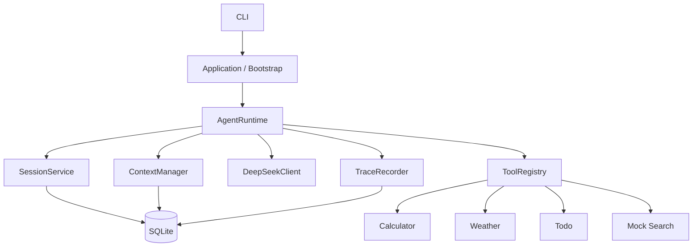

# Minimal Agent Runtime

一个使用真实 DeepSeek API、自主选择工具、支持多轮执行、Session 隔离和上下文压缩的最小通用 Agent Runtime。

核心能力：

- LLM 直接回答或自主发起 Tool Call
- 多步 Agent Loop，默认最多 8 个 LLM Step
- Calculator、Weather、Todo、Mock Search
- `user_id + session_id` 会话隔离
- SQLite 持久化与程序重启恢复
- Session Summary 与 Context 压缩
- 重复工具调用、最大步数和中断恢复保护
- Trace 执行记录
- Unit、Integration 和 Live 测试

---

# 1. 运行方式

## 1.1 环境要求

- Python 3.11+
- DeepSeek API Key

## 1.2 安装项目

```powershell
python -m venv .venv
.\.venv\Scripts\Activate.ps1
python -m pip install -e ".[dev]"
Copy-Item .env.example .env
```

编辑 `.env`：

```env
AGENT_API_KEY=your_deepseek_api_key
AGENT_BASE_URL=https://api.deepseek.com
AGENT_MODEL=deepseek-v4-pro
```

## 1.3 启动 CLI

创建新 Session：

```powershell
python -m mini_agent --user-id user_a
```

进入指定 Session：

```powershell
python -m mini_agent --user-id user_a --session-id window_1
```

常用命令：

```text
/help                       查看帮助
/new [session_id]           创建并切换 Session
/sessions                   查看当前用户的 Session
/switch <session_id>        切换 Session
/current                    查看当前用户、Session 和模型
/todos                      查看当前 Session 的 Todo
/trace [trace_id]           查看执行 Trace
/compact                    手动压缩当前 Session
/context                    查看当前 Context 估算大小
/exit                       退出
```

## 1.4 运行测试

运行单元测试和集成测试：

```powershell
pytest -q
```

运行真实 DeepSeek 和 Open-Meteo 测试：

```powershell
$env:RUN_LIVE_TESTS="1"
pytest tests/live -m live -s
```

---

# 2. 系统设计

## 2.1 总体架构



各模块职责：

| 模块             | 主要职责                                   |
| ---------------- | ------------------------------------------ |
| `AgentRuntime`   | 调度 Agent Loop，不实现 SQL 和具体工具业务 |
| `DeepSeekClient` | 调用真实 LLM，解析文本和 Tool Calls        |
| `ToolRegistry`   | 工具注册、Schema 导出、参数校验和统一执行  |
| `SessionService` | Session 创建、切换、恢复和状态管理         |
| `ContextManager` | Memory 召回、Context 构建、估算和压缩      |
| `TraceRecorder`  | 记录 LLM 决策、工具调用、耗时和异常        |
| Repository       | 封装 SQLite 数据访问                       |

## 2.2 Agent Loop

一次用户请求的执行流程：

```text
保存 User Message
→ 构建 Context
→ 调用 LLM
→ 判断直接回答或 Tool Calls
→ 执行并保存 Tool Results
→ 重新构建 Context
→ 再次调用 LLM
→ 返回最终答案
```

正常结束条件是：

```text
LLM 没有返回 Tool Calls
并且返回内容不为空
```

保护机制：

- 最多执行 8 个 LLM Step。
- 连续第三次调用相同工具和相同参数时阻止执行。
- 程序中断后自动修复缺失的 Tool Result。
- Session 在执行时设为 `busy`，结束后恢复为 `idle`。
- 工具错误会作为 Tool Result 返回给 LLM，由模型决定如何继续。

## 2.3 工具设计

| 工具         | 说明                                                     |
| ------------ | -------------------------------------------------------- |
| `calculator` | 使用 AST 白名单执行安全计算                              |
| `weather`    | 调用 Open-Meteo 查询真实天气，支持中文城市和同名城市消歧 |
| `todo`       | 在当前 Session 中新增、查询、完成和删除待办              |
| `search`     | 确定性 Mock Search，用于验证工具选择和测试               |

所有工具通过 Pydantic 参数模型生成 JSON Schema，并由 `ToolRegistry` 统一校验和执行。

## 2.4 数据持久化

SQLite 是系统的唯一真实数据源，主要保存：

```text
sessions
messages
session_summaries
todos
traces
trace_steps
```

数据通过 `user_id + session_id` 隔离。程序重启后，可以重新读取历史 Session、Messages、Summary 和 Todo。

---

# 3. Memory 的召回时机与放置方式

本项目实现的是 **Session 级 Memory**，暂不支持跨 Session 的用户偏好或长期用户画像。

## 3.1 Memory 类型

- `messages`：当前 Session 的原始对话、Tool Calls 和 Tool Results。
- `session_summaries`：较早历史消息的累计摘要。
- `todos`：当前 Session 的结构化待办状态。
- `traces`：Runtime 执行记录，只用于调试，不属于对话 Memory。

## 3.2 召回时机

`ContextManager` 在 **每一次调用 LLM 之前** 重新召回当前 Session 的 Memory。

一次用户请求可能执行多次 LLM 调用，因此每个 Agent Step 前都会重新构建 Context，使刚产生的 Tool Result 能够进入下一步推理。

## 3.3 放置方式

每次发送给 LLM 的内容包括：

```text
System Prompt
+ Session Summary
+ 当前 Session 的近期完整 Messages
+ Tool Schemas
```

具体规则：

- Session Summary 注入 System Context。
- 近期 Messages 保持原始 `user`、`assistant`、`tool` Role。
- Tool Schemas 通过 LLM API 的 `tools` 参数发送。
- Todo 不默认进入 Context，需要时由 LLM 调用 Todo Tool 查询。
- Trace 不进入 Context，只用于查看执行过程。

## 3.4 Context 压缩

当 Context 接近长度限制时：

- 达到约 70%：调用 LLM，将较早消息压缩为累计 Session Summary。
- 达到约 90%：进一步缩小近期消息窗口。
- Assistant Tool Call 和对应 Tool Result 作为完整消息组保留，不能被拆开。
- 超长 Tool Result 只在发送副本中截断。
- 原始 Messages 始终保存在 SQLite，不会因压缩被删除或修改。
- 压缩后仍超限时返回 `CONTEXT_LIMIT_EXCEEDED`，不发送非法请求。

Memory 机制可以概括为：

```text
每次 LLM 调用前
→ 读取当前 Session Summary
→ 读取近期完整 Messages
→ 加入 System Prompt 和 Tool Schemas
→ 构建本次 Context
```

---

# 4. 已知限制

- 第一版使用 CLI，没有额外 Web 页面。
- 工具同步顺序执行，不支持并行或后台任务。
- Search 为明确标记的 Mock。
- Todo 只属于当前 Session。
- Token 数为近似估算，不是模型官方分词器的精确结果。
- SQLite 适合单机 Demo，高并发场景需要迁移到服务端数据库。

更多资料：

- [测试矩阵](docs/test-cases.md)
- [AI Prompt 与问题解决记录](docs/ai-development-log.md)
