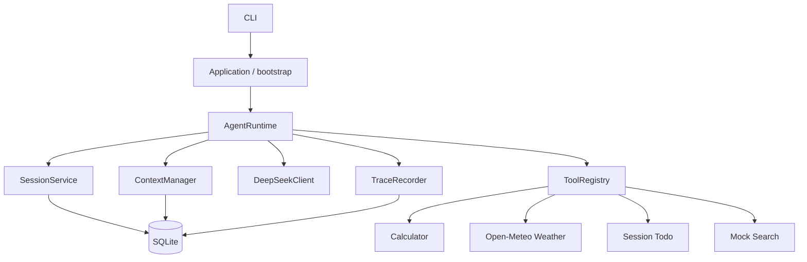

# Minimal Agent Runtime

一个模块边界清晰、可测试、可持久化的最小通用 Agent Runtime。它使用真实
DeepSeek OpenAI-compatible Chat Completions，让模型自主决定直接回答或调用工具，
并通过 SQLite 隔离和恢复每个 `user_id + session_id` 会话。

## 功能

- DeepSeek 非流式 Chat Completions，显式启用/关闭 thinking（默认关闭）
- OpenAI-compatible Tool Calls 和多步 Agent Loop
- Calculator、Open-Meteo Weather、Session Todo、Mock Search
- 工具按模型返回顺序执行，默认最多 8 个 LLM Step
- 连续相同工具参数第三次调用时阻止
- `user_id + session_id` 复合键隔离消息、Todo、摘要和 Trace
- SQLite 持久化、重启恢复和中断 Tool Call 自动修复
- 70% 累计摘要、90% 收缩窗口、完整 Tool Call 消息组保护
- 可观察 Trace：LLM 决策、工具调用/结果、耗时、Token、重试和错误
- CLI Session 管理与 Unit / Integration / Live 测试分层

## 快速启动

要求 Python 3.11+。

```bash
python -m venv .venv
# Windows PowerShell
.\.venv\Scripts\Activate.ps1
python -m pip install -e ".[dev]"
Copy-Item .env.example .env
```

编辑 `.env`，至少填写：

```env
AGENT_API_KEY=your_deepseek_api_key
AGENT_BASE_URL=https://api.deepseek.com
AGENT_MODEL=deepseek-v4-pro
```

检查配置和数据库初始化（不会打印 API Key）：

```bash
python -m mini-agent --check
```

启动：

```bash
python -m mini-agent --user-id user_a
python -m mini-agent --user-id user_a --session-id window_1
```

## 环境变量

完整模板见 [`.env.example`](.env.example)。Runtime 只读取 `AGENT_*` 变量，不读取旧
Coding Agent 或通用 OpenAI 环境变量。

| 分类 | 关键变量 | 默认值 |
|---|---|---|
| 模型 | `AGENT_MODEL` | `deepseek-v4-pro` |
| Endpoint | `AGENT_BASE_URL` | `https://api.deepseek.com` |
| 输出 | `AGENT_MAX_OUTPUT_TOKENS` | `4096` |
| 重试 | `AGENT_LLM_MAX_RETRIES` | `3` |
| Runtime | `AGENT_MAX_STEPS` / `AGENT_REPEAT_LIMIT` | `8` / `2` |
| Context | `AGENT_MAX_CONTEXT_TOKENS` | `32000` |
| 压缩 | `AGENT_SUMMARY_THRESHOLD_RATIO` | `0.70` |
| 收缩 | `AGENT_COLLAPSE_THRESHOLD_RATIO` | `0.90` |
| 数据 | `AGENT_DB_PATH` | `./data/agent.db` |

## CLI

```text
/help                       查看帮助
/new [session_id]           创建并切换 Session
/sessions                   列出当前用户 Session
/switch <session_id>        切换 Session
/current                    查看用户、Session 和模型
/todos                      查看当前 Session Todo
/trace [trace_id]           查看 Trace
/compact                    手动压缩当前 Session
/context                    查看当前 Session Context 估算
/exit                       退出
```

CLI 默认只展示工具名称、紧凑参数、成功/失败、Trace ID 和最终回答，不输出完整外部
响应或异常堆栈。

## 架构



`AgentRuntime` 只调度流程，不写 SQL、不实现工具业务。Repository 封装短事务；外部
LLM/Weather 请求期间不持有 SQLite 事务。全部对象在 `bootstrap.py` 中显式组装，
测试可注入 `ScriptedLLM`。

更完整说明见 [架构文档](docs/architecture.md)。

## Agent Loop

1. 校验或创建当前用户 Session，状态设为 `busy`。
2. 补齐上次中断后缺失的 Tool Results。
3. 保存 User Message 并创建 Trace。
4. ContextManager 构建或压缩上下文。
5. DeepSeek 返回最终文本或 Tool Calls。
6. Tool Calls 按顺序校验、执行、持久化并回传模型。
7. 得到最终文本、达到最大 Step 或发生异常后结束。
8. Trace 完成，Session 在 `finally` 中恢复为 `idle`。

一次 LLM 请求计为一个 Step；一次响应中的多个工具仍只占一个 Step。

## 工具

- `calculator`：AST 白名单，只允许数字、括号、基本二元/一元运算；限制 AST、指数和结果。
- `weather`：Open-Meteo 地理编码和日预报；中文名称无结果时自动提取城市名并转拼音重试，
  结合省份、城市层级和人口信息消歧。每日天气表示全天最严重的模型预报，不是现场实况。
- `todo`：模型参数不暴露用户或 Session ID，所有者信息只来自 `ToolRuntimeContext`。
- `search`：确定性本地数据，结果固定包含 `"mock": true`。

所有参数由 Pydantic v2 Schema 生成和校验，所有成功/失败结果使用统一 JSON 结构。

## Session 与 SQLite

SQLite 是唯一真实数据源。`sessions` 使用 `(user_id, id)` 复合主键；messages、
summaries、todos 和 traces 均通过外键关联同一所有者边界。同一个 `session_id` 可被
不同用户各自使用，但查询和切换无法跨用户。

原始消息永久保留。Session 切换不复制长期内存列表，下一轮始终从 SQLite 重建。

## Context 与 Memory

- 短期 Memory：当前 Session 原始 messages。
- 压缩 Memory：`session_summaries`，注入 System Prompt，不伪造 user/assistant 消息。
- 结构化状态：Todo 独立存储，按需调用工具，不写入摘要。
- 跨 Session Memory：不支持，避免窗口串话。

Token 估算同时包含 System Prompt、摘要、消息、Tool Calls/Results 和 Tool Schemas。
达到 70% 时累计摘要早期完整消息组；达到 90% 时使用更小的完整近期窗口；只有发送
Context 可以截短超长 Tool Result，数据库原文不变。详见
[Context 与 Memory](docs/context-and-memory.md)。

## Trace 与错误

Trace 记录可观察决策，不保存模型私有 Chain of Thought。记录内容包括：

- Context 估算与压缩边界
- LLM direct/tool decision、Token 和耗时
- Tool 名称、参数、结构化结果和耗时
- Retry、最大 Step、中断修复和 Runtime 错误

配置的 API Key 和常见敏感字段会脱敏。工具错误作为 Tool Result 交回模型，通常不
终止 Loop；LLM 重试耗尽或 Runtime 错误会返回包含 Trace ID 的用户提示。

## 测试

```bash
pytest -q
pytest tests/unit -q
pytest tests/integration -q
ruff check .
pytest --cov=mini_agent --cov-report=term-missing
```

Live 测试默认跳过。显式运行真实 DeepSeek 和 Open-Meteo：

```bash
$env:RUN_LIVE_TESTS="1"
pytest tests/live -m live -s
```

核心 T01–T20 映射见 [测试矩阵](docs/test-cases.md)。

## 设计权衡与已知限制

- 第一版同步执行工具，不做并行、后台任务或分布式锁。
- Search 是明确标记的 Mock，不代表真实互联网搜索。
- Token 数是可替换的近似估算，32k 是项目软限制。
- Todo 只属于 Session；没有跨 Session 长期 Memory。
- CLI 是核心交付；没有额外 Web 层，避免重复 Agent Loop。
- SQLite 适合单机最小 Runtime，高并发服务应迁移到服务端数据库。
- 模型名和服务能力依赖 DeepSeek 账户与当前 API 可用性。

## AI 辅助开发记录

开发问题、Prompt、建议和最终判断记录在
[AI Development Log](docs/ai-development-log.md)。


