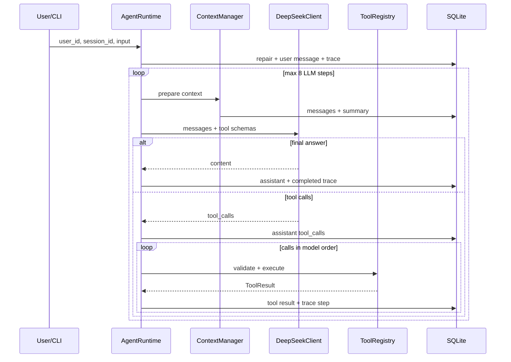

# Architecture

## 模块边界

| 模块 | 负责 | 不负责 |
|---|---|---|
| `AgentRuntime` | Agent Loop、保护条件、依赖调度 | SQL、工具业务、SDK 解析 |
| `DeepSeekClient` | 非流式 API、响应转换、Retry | 工具执行、Session |
| `ToolRegistry` | 注册、Schema、校验、统一结果 | Session 所有权决策 |
| `SessionService` | ID 规范化、所有者边界、预览、恢复 | 长期内存列表 |
| `ContextManager` | 摘要、窗口、Token、API Context | 修改/删除原始消息 |
| `TraceRecorder` | 可观察事件、脱敏、状态 | Chain of Thought |
| Repository | SQLite SQL 和短事务 | 外部网络调用 |

## 调用序列

## 数据一致性

- 每次状态变化使用短事务；LLM 和 Weather 请求期间没有数据库事务。
- 外键始终开启，WAL 和 `busy_timeout` 在每个连接上设置。
- 数据库连接在事务块退出后提交/回滚并关闭。
- Assistant Tool Calls 完整保存原始 arguments；对应 Tool Result 缺失时补写
  `INTERRUPTED`。
- Session 运行状态在 `finally` 中恢复为 `idle`；启动时恢复遗留 `busy` 并写 Trace。

## 依赖注入

`build_application()` 组装 Database、Repository、Service、LLM、Tools、Context、
Trace 和 Runtime。测试可传入 `ScriptedLLM` 或自定义 `ToolRegistry`，因此普通测试
不访问真实 API。

